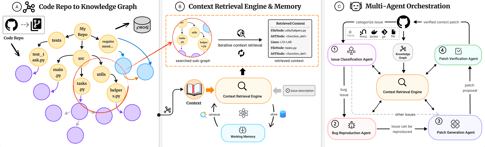
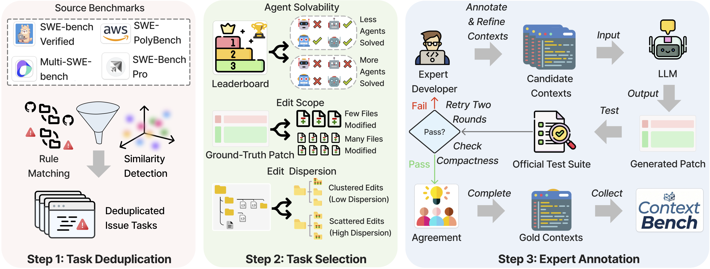








I am a third-year undergraduate student in Computer Science at [**University College London (UCL)**](https://www.ucl.ac.uk/), where I am a member of the [**SOLAR Group**](https://solar.cs.ucl.ac.uk/) under the supervision of [**Prof. He Ye**](https://heye.me/).
Now I'm also working with [**Dr. Shilong Liu**](https://lsl.zone/) at [**Princeton AI Lab**](https://ai.princeton.edu/ai-lab) in a multimodal code agent project.
My research interests lie in automated software engineering and agentic systems, with a particular focus on long-horizon issue resolution, program understanding, and LLM-based code agents.
My academic journey has also been enriched by collaborations with [**Prof. Sergey Mechtaev**](https://mechtaev.com/) at [**Peking University**](https://english.pku.edu.cn/).

Beyond academia, I have been actively involved in technology entrepreneurship. I am a co-founder of [**EuniAI**](https://euni.ai/), [**Aimoverse**](https://aimo.network/), and Hangzhou RongzhiruanKe Ltd., where I have led the development of AI-driven products and enterprise systems.

For more details about my background, please see my [**CV**](../assets/pdf/Yue_Pan_Resume.pdf).

🌟🌟 **Excited to share: I will be in Rio de Janeiro, Brazil for [ICSE 2026](https://conf.researchr.org/home/icse-2026) in April, looking forward to meet you there!** 🤗🤗

# 🔥 News
- **[2025-11]** Our work Prometheus achieves state-of-the-art performance with 74.4% and 33.8% resolution rates on **[SWE-bench Verified leaderboard](https://www.swebench.com/)** and **[SWE-Polybench Verified leaderboard](https://amazon-science.github.io/SWE-PolyBench/#verified)**, ranking Top-6 and Top-1🏆 among open-source agent systems respectively🎉!

# 📝 Publications 

  

    
Preprint

      
    

  

  

[Prometheus: Unified knowledge graphs for issue resolution in multilingual codebases](https://arxiv.org/pdf/2507.19942)

**Yue Pan**\*, Zimin Chen\*, Siyu Lu, Zhaoyang Chu, Xiang Li, Han Li, Yang Feng, Claire Le Goues, Federica Sarro, Martin Monperrus, He Ye†.

\[ [Code](https://github.com/EuniAI/Prometheus) \] \[ [Paper](https://www.arxiv.org/abs/2507.19942) \]
  

  

    
Preprint

      
    

  

  

[ContextBench: A Benchmark for Context Retrieval in Coding Agents](https://arxiv.org/abs/2602.05892)

Han Li, Letian Zhu\*, Bohan Zhang\*, Rili Feng\*, Jiaming Wang, **Yue Pan**, Earl T. Barr, Federica Sarro, Zhaoyang Chu†, He Ye†.

\[ [Homepage](https://contextbench.github.io/) \] \[ [Paper](https://arxiv.org/abs/2602.05892) \] \[ [Code](https://github.com/EuniAI/ContextBench) \] \[ [Dataset](https://huggingface.co/datasets/Contextbench/ContextBench) \]

  

# 🎖 Honors and Awards
- *2021.11* AMC12A (2021) the top 2.5%
- *2022.04* Euclid Contest Certificate of Distinction

# 📖 Educations
- *2023.09 - 2027.06 (now)*, University College London (UCL), MEng Computer Science.
- *2019.09 - 2013.06* Beijing National Day School (BNDS), Beijing, China.

# 💻 Work Experiences

- **2025.03 – Present** · **Research Assistant**, UCL SOLAR Group, London  
  Leading the development of **Prometheus**, an AI-powered code agent for long-horizon issue resolution using knowledge graphs and agentic memory, supervised by [**Prof. He Ye**](https://heye.me/).

- **2025.06 – 2025.09** · **Research Assistant**, Peking University, Beijing  
  Conducted research on context compression and efficient summarization for large-scale code agent systems,supervised by [**Prof. Sergey Mechtaev**](https://mechtaev.com/) .

- **2024.11 – 2025.07** · **Researcher & CTO**, Aimoverse  
  Co-developed [*Amico*](https://amico.dev/), a modular general AI agent framework built with Rust and WebAssembly for persistent autonomy.

- **2024.01 – 2024.09** · **CTO & Co-founder**, Hangzhou RongzhiruanKe Ltd., China  
  Led the development of embedded AI agent and enterprise systems serving over 10,000 users.

- **2023.06 – 2023.09** · **Software Engineer Intern**, Chengdu Lvbeichuxing Xinnengyuan Ltd., China  
  Built an ERP system from scratch using Django and React for internal business operations.

# 📞 Contact
Please feel free to contact me if you are interested in my research or want to collaborate on some projects. I am also happy to share my experience in research and technology entrepreneurship!

Email: **jack.pan.23@ucl.ac.uk**
